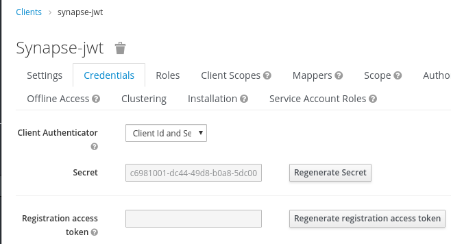
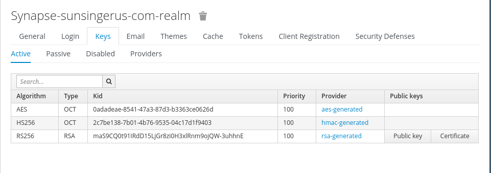

# matrix-synapse-keycloak
Keycloak auth provider for Synapse

### Install

1. Add keycloak_auth_provider.py to python PATH folder

2. Add "password_providers" section to synapse config
```
password_providers:
  - module: "keycloak_auth_provider.KeycloakAuthProvider"
    config:
      enabled: true
      url: "https://keycloak.sunsingerus.com/auth/"
      client_id: "synapse-jwt"
      realm_name: "synapse-sunsingerus-com-realm"
      secret_key: "c6981001-dc44-49d8-b0a8-5dc0099df30c"
      public_key: "MIIBIjANBgkqhkiG9w0BAQEFAAOCAQ8AMIIBCgKCAQEAhLI3RkLNuZk08ypLDz5YOZNX+nBdOWxWpDsFG/7zN1vX0mPHeuiu2oe8RY2SO6GtUlpRxu++Y5/5EY2W+f3ETfvE3JFEFGgvjV8QlrWSPLfQMWa/45ZKUME20fCzJcMJmlymrm0yos+PNjlNi84IjwDcapGQs5/JRbhG5lW1uKcld2gu/9pR0y2lebkJfvZhPW9Jwit8tbjEzOH5VVl8j4GWA+yHTIyWYApjmubM2pY6a2NdrxlvL4kFKx5buhcedR057JJPuTTrIyQ8IVsvqJ+oBQ9p5pEbxf1j13gSV/PTLcYK8tkx8lrOqJ0EKIm3wNzwOZVIXtBfTLaKKbzmpQIDAQAB"
      algorithm: "RS256"
      profile_attrs:
        display_name: displayName
        medium: medium
        address: address
```

secret_key


public_key

